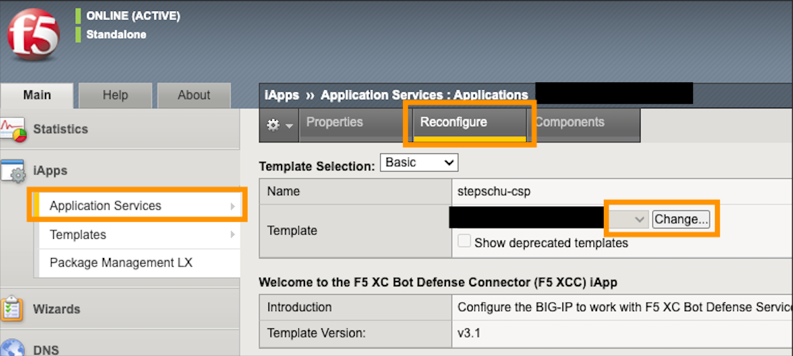

> ## Disclaimer: The changes below will change the officially supported iApp version to provide the best user experience (integrated iRules). However, be aware that ALL changes are on your own risk.

<br />

**_NOTE:_** This integration is for the iApp version 3.1 only.

**_NOTE:_** The iApp can be downloaded from the app definition within the F5XC portal 

**_NOTE:_** Important, do all steps in the right order. Otherwise your line numbers will not fit to this example.

<br /> 

example:


<br />

---
## Add this code to the template file. 

---
### 01 - Verify if CSP is enabled and if nonce is used.

* Open the iApp template with any editor 
* add / change the following code at line: 2515

<br />

```

        set nonce 1
        if {[HTTP::header exists "Content-Security-Policy"]} {
                set nonce [findstr [HTTP::header Content-Security-Policy] \'nonce 7 \']
        } elseif {[HTTP::header exists "Content-Security-Policy-Report-Only"]} {
                set nonce [findstr [HTTP::header Content-Security-Policy-Report-Only] \'nonce 7 \']
        } else {
        return
        }

```

<br />


<br />

---
### 02 - insert the nonce value (if present) into the existing JS_snippet

* add / change the code at line: 2673 

<br />

```

        if {$nonce != 1} {
                set map_find "<script"
                set map_replace "<script nonce=$nonce"
                regsub -nocase -all $map_find "${I1_js_io_snippet}" $map_replace js_snippet
        } else {
        set js_snippet $I1_js_io_snippet
        }

```

<br />


<br />

### 03 - delete the no longer needed step to build the snippet

* delete the line 2680 (it is handled already in the statement before)

<br />

```

        set js_snippet $I1_js_io_snippet

```

<br />


<br />

### 04 - release the variable

* add / change the code at line: 2708 to release the variable.

<br />

```

        unset nonce

```

<br />


<br />

---
### 05 - Save and import the template into your BIG-IP and use it / replace the old one.  

<br />


<br />



<br />